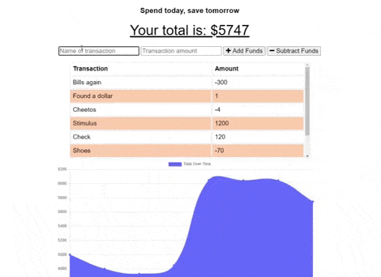

# bud-get
Spend today, save tomorrow

## About
With this app you can track your spending and saving, close it out, forget about it, and come back to it later. Takes a nibble of stress out of personal finances.

## Links
* Deployed app on Heroku: [https://calm-anchorage-17785.herokuapp.com/](https://calm-anchorage-17785.herokuapp.com/)
* Repository: [https://github.com/coryjquirk/bud-get](https://github.com/coryjquirk/bud-get)
### Demo

## Usage
* Run in your web browser or download the application to your phone
* Add funds or subtract funds based on earning and spending

## Features
* Dynamic graph showing total budget over time
* Your data is stored:
    * in browser if the server stops running
    * remotely if you shut down the app

## Features in Development
* More graphs
* User authentication
    * Two-factor by cell/email
* More storage options

## Installation
None needed, it runs right in your browser.

## Tools Used
* MongoDB
* Heroku
* Node.js
* Express (API routing)
    * code for which is compressed JavaScript
* Heroku (deployment)
    * MongoDB Atlas for remote data storage
* Progressive Web Application format 
    * Service worker
    * Cache API
    * Web manifest

## License
* The Unlicense